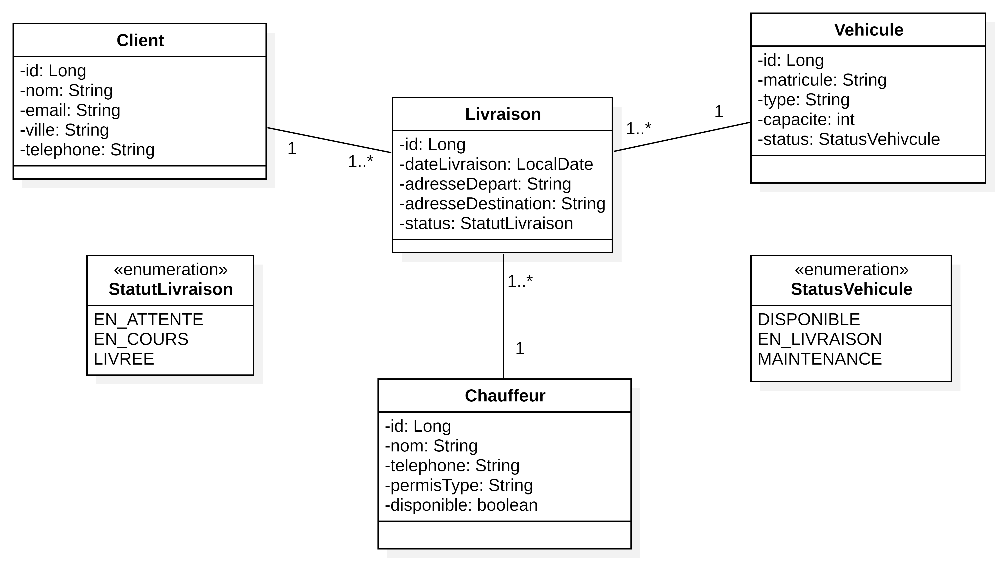
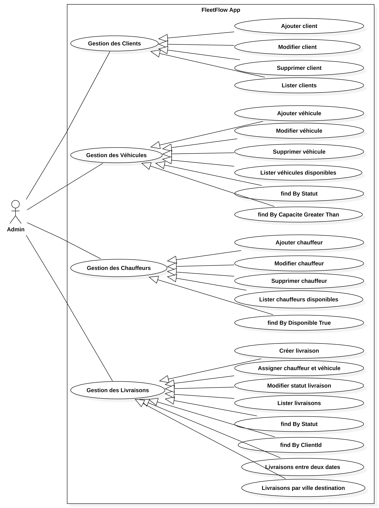

FleetFlow API
📝 Description
FleetFlow API est une solution RESTful conçue pour optimiser et automatiser la planification ainsi que la gestion de la logistique de livraison. Ce projet met l'accent sur une architecture propre, la maintenabilité et la facilité de déploiement.

🚀 Fonctionnalités Clés
Planification des livraisons : Gestion complète des flux de travail de livraison via des endpoints dédiés.

Versionnage de base de données : Intégration de Flyway pour assurer des migrations SQL versionnées et reproductibles.

Architecture Propre (Clean Architecture) : Structure multicouche utilisant des DTOs, MapStruct pour le mapping d'entités, et JPA pour la persistance.

Documentation Interactive : Interface Swagger UI intégrée pour tester et explorer l'API en temps réel.

Conteneurisation : Prêt pour la production avec Docker et Docker Compose.

🛠 Pile Technique
Langage : Java 21

Framework : Spring Boot 3.2.4

Persistance : Spring Data JPA / Hibernate

Base de données : MySQL 8.0 (Production/Dev), H2 (Tests)

Migrations : Flyway

Mapping : MapStruct 1.5.5

Productivité : Lombok

Validation : Spring Boot Starter Validation

Documentation : SpringDoc OpenAPI v2.4.0

🐳 Installation et Lancement avec Docker
Ce projet est entièrement conteneurisé pour faciliter son exécution dans n'importe quel environnement.

Prérequis
Docker et Docker Compose installés sur votre machine.

Construire et démarrer
Pour compiler l'application et lancer les services (API + Base de données MySQL), utilisez la commande suivante à la racine du projet :

docker compose up --build

Arrêter l'application
Pour stopper les conteneurs et libérer les ressources :

docker compose down

🔍 Vérification et Tests
Une fois l'application démarrée, vous pouvez accéder à la documentation interactive et tester les différents endpoints via l'URL suivante :

👉 http://localhost:8080/swagger-ui.html

Tests Automatisés
Le projet inclut une suite de tests unitaires et d'intégration utilisant JUnit 5 et une base de données H2 en mémoire.

./mvnw test

🏗 Structure du Projet
Le code est organisé selon les standards Spring Boot :

controller/ : Points d'entrée de l'API.

service/ : Logique métier.

repository/ : Interface avec la base de données.

entity/ : Modèles de données JPA.

dto/ : Objets de transfert de données.

mapper/ : Conversion entre Entités et DTOs.

db/migration/ : Scripts de migration Flyway.

